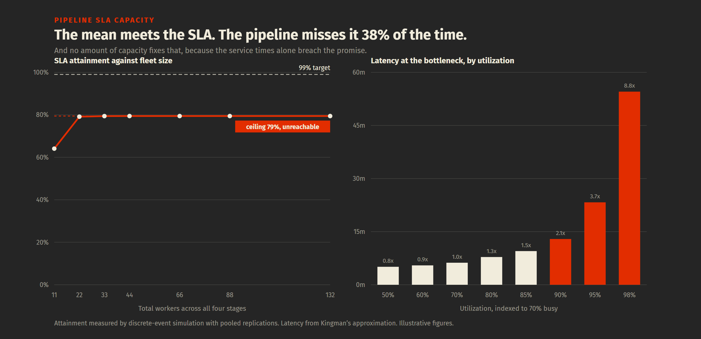

# Pipeline SLA capacity

> Queueing theory applied to data pipeline freshness. Answers the question a
> data leader gets asked before every platform budget: how much capacity holds
> a 15-minute SLA, and is the SLA even reachable.

[](https://github.com/wanwrick/pipeline-sla-capacity/actions/workflows/tests.yml)



---

## The finding

On the illustrative pipeline in `scenarios/`:

| | |
|---|---|
| Mean end-to-end latency | 13.9 min, inside a 15-minute SLA |
| Batches actually inside the window | **64%** |
| p95 | 27.6 min |
| Attainment after adding 12 workers | 79%, then it stops improving |
| Ceiling with unlimited capacity | **79%** |
| Service-time p99 with zero queueing | **31.9 min** |

**The SLA is unreachable by any capacity plan.** With every queue driven to
empty, the pipeline's own service times breach a 15-minute promise one run in
five. Buying compute for that target is buying nothing.

The three real options, which the generated memo states in order: re-price the
promise at 23.1 minutes for 95% or 31.9 minutes for 99%, cut variability at the
bottleneck before buying anything, or scope a multi-stage redesign. The full
memo is in [`output/capacity.md`](output/capacity.md).

---

## Why this repo exists

Capacity planning for data platforms is usually done by watching a utilization
chart and adding workers when it looks high. That method fails in two specific
ways, and both are visible above.

**An average is not a service level.** A mean inside the SLA and 64% attainment
are the same pipeline. A freshness dashboard reporting the mean shows green
every day the promise breaks.

**Latency does not rise linearly with utilization.** The delay term is
rho/(1-rho). Going from 70% to 80% busy costs 1.3x the delay. Going from 90% to
98% costs 8.8x. The last few points of utilization are the most expensive
capacity in the estate, and they are exactly what a cost-reduction exercise
reaches for first.

A pipeline stage is a queue. Once that is accepted, "how much capacity do we
need" stops being a judgement call.

---

## Run it

```bash
pip install -r requirements.txt
python run.py --summary       # stage table, instant
python run.py --fast          # full analysis, fewer batches
python run.py                 # writes output/capacity.md
pytest -q                     # 59 tests
```

Edit `scenarios/customer_360.yaml` and rerun. The memo is generated from the
model, including which of the three recommendations it makes.

---

## How it works

```
scenarios/customer_360.yaml       four stages, an SLA, and prices
        |
        v
  queueing.py     Erlang C, Kingman's V x U x T, Little's Law
  pipeline.py     stages in series, bottleneck, per-stage targets
        |
        +-- simulate.py    discrete events, pooled replications
        |                  -> percentiles and attainment
        +-- planning.py    capacity plan, and the ceiling it cannot pass
        +-- economics.py   capacity cost against breach cost
        v
  report.py       decision memo, recommendation first
        |
        v
  output/capacity.md
```

### Four decisions that change the answer

**Analytic sizing, simulated attainment.** Closed forms give a mean. An SLA is a
percentile. The model sizes with Kingman and measures attainment by simulation,
because neither tool answers the other's question.

**Independent replications, not one long run.** One run of a queue is not an
estimate. Successive waits are strongly autocorrelated, and single 100k-batch
runs of an M/M/3 queue were measured here landing 8% low to 13% high while
looking perfectly convergent. Pooling twenty replications brings the same
estimate inside 1.5%, and a test enforces it.

**Variability is a first-class input.** `arrival_cv` and `service_cv` are the V
in the VUT equation and the input almost nobody measures. It enters the wait
linearly, so halving it halves the wait at any utilization. That is usually an
engineering change rather than an invoice, and it is the lever least often
pulled.

**The bottleneck is the slowest stage, not the busiest.** They usually coincide
and occasionally do not. A capacity plan built off a utilization chart funds the
wrong stage when they diverge.

---

## Frameworks applied

| Framework | Course | Where it shows up |
|---|---|---|
| Little's Law | Operations Management (Prof. Yao Cui) | `queue_length`, `work_in_progress` |
| VUT equation and Kingman's approximation | Operations Management | `kingman_wait_time`, `vut_factors` |
| Erlang C and M/M/c | Operations Management | `erlang_c`, `mmc_wait_time` |
| Process analysis and bottleneck identification | Operations Management | `PipelineResult.bottleneck` |
| Capacity cost against shortage cost | Operations Management, newsvendor logic | `economics.cost_curve` |
| Break-even and relevant costing | Managerial Accounting (Prof. Danny Szpiro) | `CostModel`, marginal value per worker |
| Monte Carlo and simulation design | Business Decision Models (Prof. Paul Roman) | `simulate.py` replications |
| SCR and the Pyramid Principle | Critical Thinking (Prof. Risa Mish) | `report.py` structure |

---

## Tests

```bash
pytest -q        # 59 tests
```

The load-bearing test is `test_simulation_reproduces_the_closed_form`. The whole
repo rests on the analytic model sizing the system and the simulation measuring
attainment, and that split is only safe while the two agree on the statistic
they both compute. It asserts pooled replications land within 6% of exact M/M/c
at three utilizations.

Others pin down claims the memo makes in prose:

| Test | The claim it defends |
|---|---|
| `test_the_mean_meets_the_sla` | Half the finding: on paper the pipeline is fine |
| `test_attainment_does_not` | The other half. If these ever agree, the memo is wrong |
| `test_capacity_alone_cannot_reach_the_target` | The recommendation rests on this |
| `test_the_cliff_is_steeper_at_the_top` | The argument against running hot, in one assert |
| `test_doubling_variability_doubles_the_wait` | Why V is the cheapest lever |
| `test_zero_variability_means_zero_wait_in_the_formula` | Analytic and simulated agree at the edge case |
| `test_the_attainment_plan_gives_up_rather_than_overspending` | The planner reports failure instead of buying nothing |

---

## What is not modelled

Stated plainly, because a model that hides its edges is worse than no model.

- **Stage latencies are sampled independently and summed.** A slow upstream
  batch tends to arrive into a busy downstream stage, and that correlation is
  absent. Real attainment is therefore a little worse than reported, not better.
- **No retries, no partial failures, no backfills.** Each is a separate arrival
  process and each would widen the tail.
- **FIFO only.** Priority scheduling would change the picture for a subset of
  batches without changing the mean.
- **Autoscaling is not modelled.** Server counts are fixed within a run, so the
  analysis answers a provisioning question rather than a scaling-policy one.
- **No confidence intervals on simulated results.** Replications are pooled
  rather than used to report a standard error, which would be the next
  improvement.

---

## A note on the numbers

Every figure in `scenarios/` is illustrative and belongs to no employer. They
describe the shape of a CDC-fed medallion pipeline serving a customer data
product. The point of the repo is the method, not the dataset.

---

**Paroz Mehta** · [LinkedIn](https://linkedin.com/in/parozmehta)
